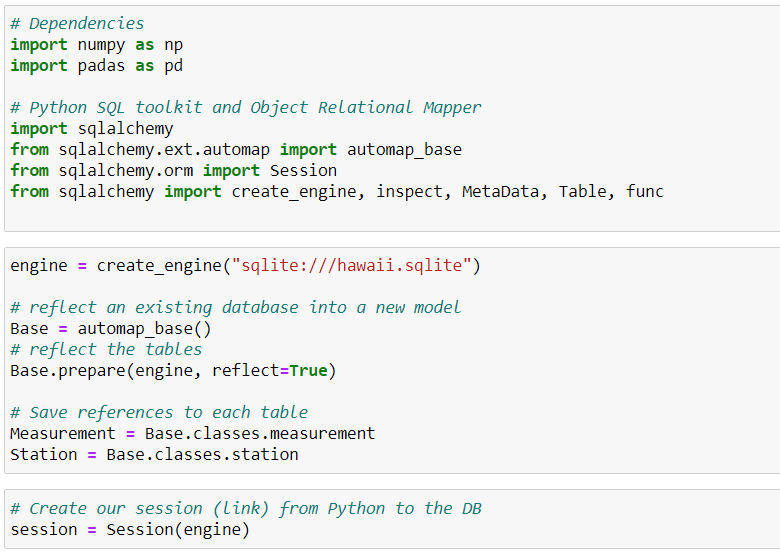
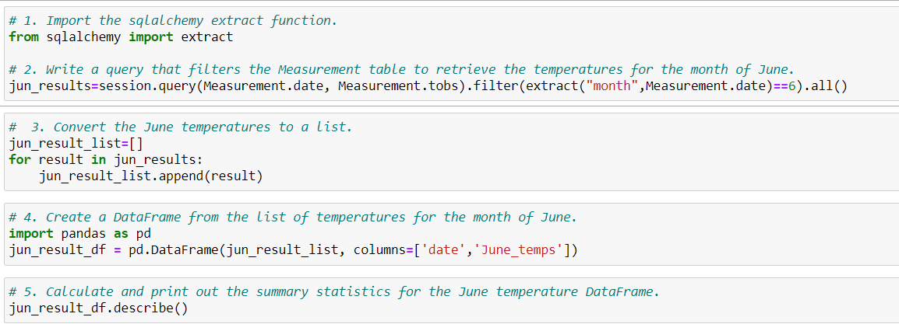
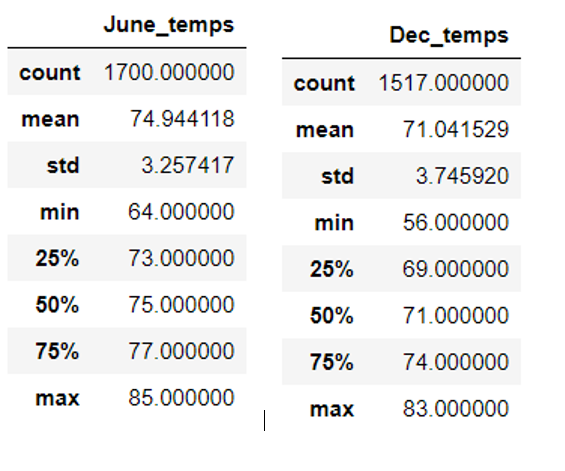
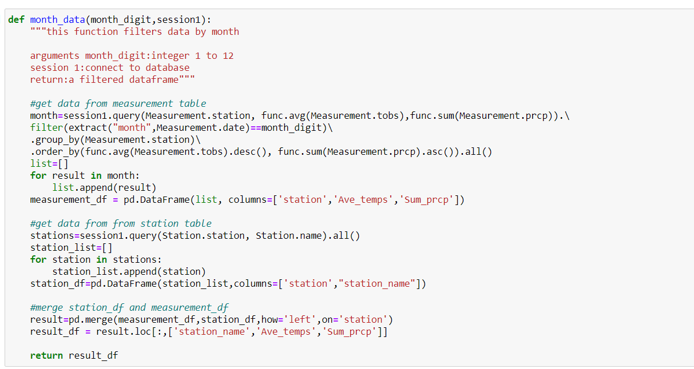
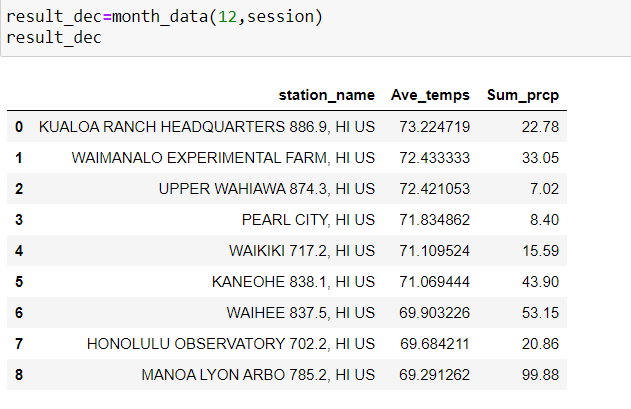
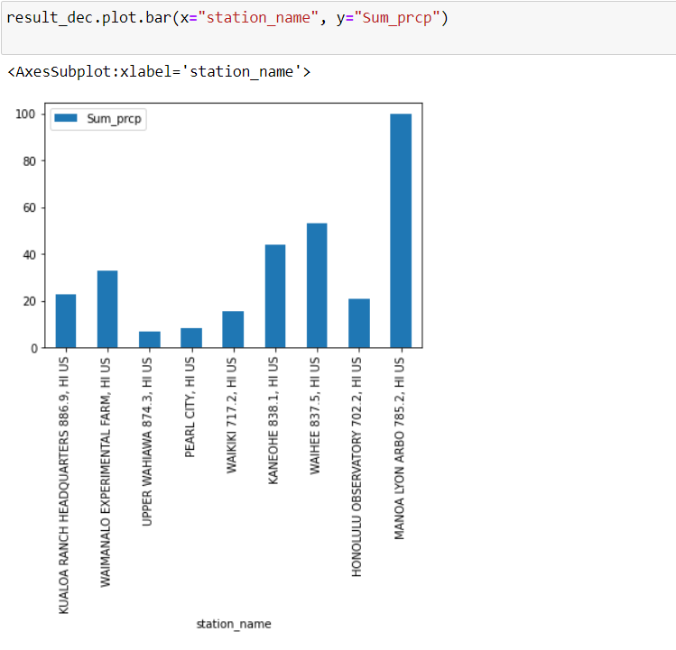
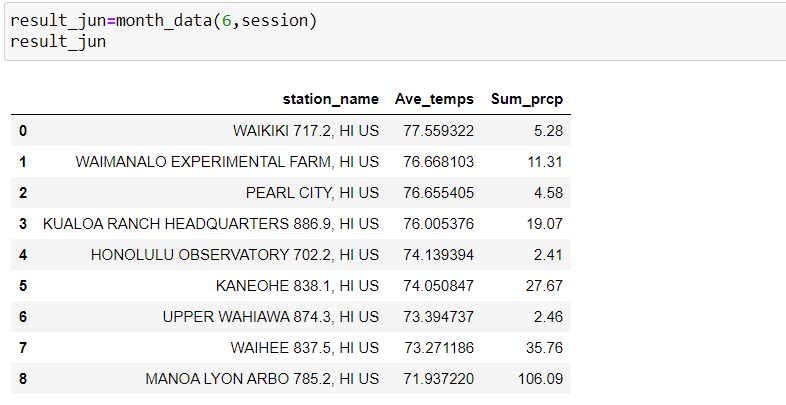
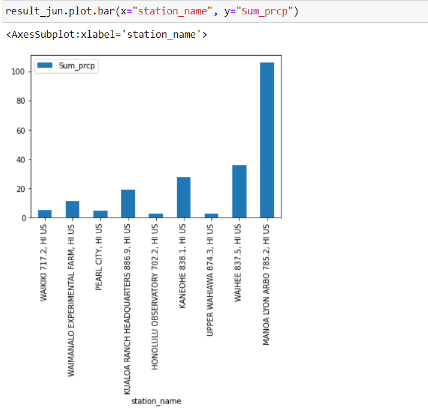

# surfs_up

## Overview of the analysis
This project is to help an investor, W.Avy, to retrieve temperature information in month of June and December temperature from a SQLite database of Hawaii weather before opening the surf shop. To prepare information, we need to apply sqlalchemy and python skills we had learned in class.

## Results
* We need to use SQLalchemy library to setup engine, reflect data into base and save table into reference. After we make the seesion (link), we can use Python to access the database and then do the analysis.

* Then, we can convert the results into DataFrame data type. In this way, we can use function "describe" to get the summary statistics for Jun and Dec.

*  Compare Jun and Dec statistics summary, we can conclude following:
1. There are 1,700 count of data in month of Jun and 1,517 count of data in month of Dec.
2. The average temperature is 74.94 degrees Fahrenheit in month of Jun and 71.04 degrees Fahrenheit in month of Dec.
3. The standard deviation is 3.25 degrees Fahrenheit in month of Jun and 3.75 degrees Fahrenheit in month of Dec.
4. The minimum temperature is 64 degrees Fahrenheit in month of Jun and 56 degrees Fahrenheit in month of Dec.
5. The maximum temperature is 85 degrees Fahrenheit in month of Jun and 83 degrees Fahrenheit in month of Dec.

## Summary

* Not only temperature influence the business. The business will be impacted if it rains a lot. Therefore, we would like to include the precipitation information in June and December weather summary. Although Hawaii is a small island, the weather will be different from location to locate. We would like to include location into consideration while analyzing the weather. We define a function to query monthly average temperature and sum of precipitation since we will assume business will thrive if it is hot and rains less in a month. Then, merge the measurement table with station in order to know the weather in different stations and what location might be a better place, hot and dry, to start the business.

* As you can see from picture below. There are no big differences in temperature among stations in December. Maximum average temperature is in KUALOA RANCH HEADQUARTERS, 73 degrees Fahrenheit, and minimum average is in MANOA LYON ARBO, 69 degrees Fahrenheit. Merely 4 degrees Fahrenheit difference. We can conclude that it was the hot everywhere in December. On the other hand, it didn’t rain the same everywhere in December. We can see the bar chart for better vitalization. It rained less in UPPER WAHIAWA and PEARL CITY.

* As you can see from picture below. There are relatively bigger differences in temperature among stations in June. Maximum average temperature is in WAIKIKI, 78 degrees Fahrenheit, and minimum average is in MANOA LYON ARBO, 72 degrees Fahrenheit. 6 degrees Fahrenheit difference. On the other hand, MANOA LYON ARBO rained a lot during data collected period. HONOLULU OBSERVATORY and UPPER WAHIAWA rained less.

